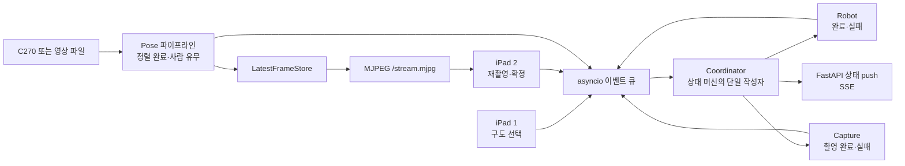
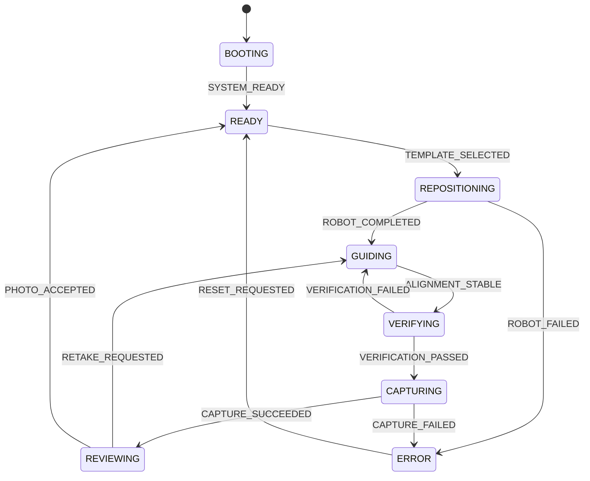

# 런타임 소프트웨어 아키텍처

이 문서는 [`camera-robot-architecture.html`](camera-robot-architecture.html)의 상위 설계를 실제 Python
코드로 구현하기 위한 기준이다. 기능을 줄이지 않으면서도 해커톤 규모에 맞게 구조를 단순하게 유지하는
것이 목표다.

## 핵심 결정

- 사용자는 명령 하나로 전체 시스템을 실행한다. 코드는 책임별 모듈로 나누되 기본 배포 단위는 Python
  프로세스 하나다.
- 워크플로는 이벤트 기반 상태 머신으로 관리한다. 기존 GaP의 슬롯 선택 개념은 유지하되 전체 흐름을
  2Hz로 폴링하지 않고 UI·촬영·오류 이벤트를 발생 즉시 처리한다.
- ROS 2는 phorce 로봇 경계에서만 사용한다. Pose, 웹 UI, 촬영폰, 상태 머신에는 ROS를 전파하지 않는다.
- 상태는 `Coordinator` 한 곳에서만 변경한다. 다른 모듈은 이벤트를 발행하거나 결과를 제공할 뿐이다.
- 영상 프레임과 업무 이벤트를 분리한다. 프레임은 최신 프레임 버퍼, 업무 신호는 이벤트 큐로 전달한다.
- 하드웨어가 바뀌는 세 지점(Robot, Capture, Camera/Pose)만 작은 인터페이스로 격리한다.
- 노트북에서는 fake/녹화 영상을 사용해 전체 시나리오를 완성하고, Jetson에서는 설정으로 실제 구현체만
  교체한다.

## 전체 실행 구조



공유 메커니즘은 세 개만 둔다.

1. `event_queue`: 의미 있는 이벤트 전달
2. `WorkflowContext`: 현재 세션과 상태의 단일 정본
3. `LatestFrameStore`: iPad 2에 보여줄 최신 합성 프레임

프레임을 이벤트 큐에 넣지 않는다. Pose 루프는 15~30Hz로 프레임 버퍼를 갱신하되,
`PERSON_DETECTED`, `ALIGNMENT_STABLE`처럼 의미가 바뀔 때만 이벤트를 발행한다.

## 저장소 코드 구조

초기 구현은 아래 정도로 시작한다. 파일이 실제로 커지기 전에는 하위 패키지를 더 만들지 않는다.

```text
config/
├── dev.yaml
└── jetson.yaml

src/geekseek/
├── __main__.py       # 실행 진입점
├── config.py         # YAML 설정 로딩
├── workflow.py       # State, Event, WorkflowContext, 전이 규칙
├── coordinator.py    # 이벤트 처리와 비동기 작업 오케스트레이션
├── perception.py     # 카메라, Pose, 정렬 점수, 오버레이
├── verification.py   # 로컬 검증 + 선택적 VLM 검증
├── robot.py          # Robot 인터페이스 + FakeRobot + PhorceRobot
├── capture.py        # Capture 인터페이스 + fake/폰 HTTP 구현
└── web.py            # FastAPI, SSE, MJPEG, iPad API

web/
├── face.html
├── guide.html
├── app.js
└── style.css

tests/
├── test_workflow.py
├── test_alignment.py
└── test_fake_scenario.py
```

### 모듈 책임

| 모듈 | 책임 | 하지 않는 일 |
|---|---|---|
| `workflow.py` | 상태·이벤트·컨텍스트·전이 규칙 | FastAPI, OpenCV, ROS import |
| `coordinator.py` | 이벤트 소비, 상태 변경, 로봇/촬영 작업 시작 | Pose 추론, HTTP 라우트 정의 |
| `perception.py` | 프레임→Pose→점수→오버레이 | 워크플로 상태 직접 변경 |
| `verification.py` | 정렬된 후보 프레임의 최종 검증, 선택적 VLM 호출 | 실시간 Pose 루프, 촬영·로봇 호출 |
| `robot.py` | fake 또는 phorce 슬롯 재생 | 구도 선택 정책, UI 처리 |
| `capture.py` | fake 또는 촬영폰 HTTP 왕복 | 워크플로 상태 직접 변경 |
| `web.py` | iPad 페이지·API·SSE·MJPEG | 상태 직접 변경, 하드웨어 호출 |
| `config.py` | dev/jetson 구현체 선택에 필요한 설정 | 자동 플러그인 탐색, DI 프레임워크 |

## 상태 머신

진행 단계만 상태로 만들고, 선택된 템플릿·정렬 점수·사진 URL 같은 값은 `WorkflowContext`에 둔다.
사람 감지 여부와 템플릿 선택 여부를 모두 별도 상태로 만들지 않아 상태 폭발을 피한다.



초기 P0에서는 `LocalVerifier`가 Pose 정렬 결과만 확인하고 즉시 `VERIFICATION_PASSED`를 반환한다.
VLM 없는 전체 흐름을 먼저 완성한 뒤 같은 `Verifier` 인터페이스에 `VlmVerifier`를 선택적으로 연결한다.
상태 머신·웹·촬영 코드는 이 확장 때문에 바뀌지 않는다.

A 트랙 전에는 `FakeRobot.move_to()`가 짧은 지연 뒤 `ROBOT_COMPLETED`를 발행한다. Jetson에서는 같은
인터페이스의 `PhorceRobot`이 `slot_map`을 조회해 `robot.play(id)`를 실행한다.

## 데이터 흐름

### 영상 경로

```text
C270/영상 파일
→ PoseEstimator
→ AlignmentScorer
→ OverlayRenderer
→ LatestFrameStore
→ GET /stream.mjpg
→ iPad 2
```

정렬 점수는 임계값을 한 프레임 넘었다고 바로 완료로 보지 않는다. 설정된 N프레임 동안 유지됐을 때만
`ALIGNMENT_STABLE`을 한 번 발행하고, 충분히 벗어나면 `ALIGNMENT_LOST`를 발행한다.

### 상태·제어 경로

```text
iPad/Pose/Robot/Capture 이벤트
→ asyncio.Queue
→ Coordinator
→ WorkflowContext 갱신
→ SSE로 두 iPad에 상태 push
```

iPad용 API의 역할은 이벤트 발행뿐이다.

| 장치 | 페이지·API | 역할 |
|---|---|---|
| iPad 1 | `/face`, `POST /api/template/{id}`, `/events` | 얼굴/상태, 구도 선택 |
| iPad 2 | `/guide`, `/stream.mjpg`, `/events`, `/api/retake`, `/api/accept` | 가이드, 결과, 재촬영/확정 |

### 촬영 경로

```text
CAPTURING 진입
→ CaptureDevice.capture()
→ 아이폰/안드로이드 HTTP 호출
→ 이미지 저장
→ CAPTURE_SUCCEEDED(url) 또는 CAPTURE_FAILED(reason)
```

폰 기종별 차이는 `capture.py` 안에만 남고 상태 머신과 웹 API에는 노출하지 않는다.

## 선택적 VLM 검증

VLM은 필수 경로가 아니라 `VERIFYING` 상태의 선택적 보강 게이트다. 실시간 Pose 루프에는 넣지 않고,
정렬 점수가 N프레임 유지된 순간 고정한 후보 프레임 한 장에만 호출한다.

```python
@dataclass
class VerificationResult:
    passed: bool
    reason: str = ""
    hint: str = ""


class Verifier(Protocol):
    async def verify(
        self,
        frame: bytes,
        context: WorkflowContext,
    ) -> VerificationResult: ...
```

구현은 복잡한 플러그인 체인 대신 두 가지로만 시작한다.

- `LocalVerifier`: Pose 정렬·향후 로컬 실루엣 검증. P0 기본값이며 외부 네트워크가 필요 없다.
- `VlmVerifier`: 로컬 검증을 먼저 통과한 후보에 대해 표정·전체 구도·어색한 자세를 추가 확인한다.

```yaml
verification:
  vlm_enabled: false
  timeout_seconds: 3
  fail_open: true
```

`vlm_enabled: false`에서는 VLM 코드를 호출하지 않는다. 나중에 `true`로 바꾸면 같은 `VERIFYING` 상태에서
VLM을 추가 호출한다. `fail_open: true`이므로 네트워크 오류·타임아웃·API 오류가 발생하면 로컬 검증 결과로
계속 진행하고, VLM 때문에 기본 촬영 기능이 멈추지 않는다. 호출 중에는 iPad 2에 "AI가 구도를 확인하고
있어요" 상태를 즉시 표시한다.

테스트는 VLM 실제 API 없이도 다음 세 결과를 fake로 먼저 고정한다.

1. 통과 → `VERIFICATION_PASSED`
2. 구도 거절 → 이유·이동 힌트와 함께 `VERIFICATION_FAILED`, `GUIDING` 복귀
3. 타임아웃/오류 → 로컬 결과로 계속 진행(fail-open)

## ROS 2 경계

B·C·D와 기본 fake 전체 시나리오는 ROS 없이 실행한다. Jetson의 A 통합에서만 ROS 환경을 사용한다.
단, 로봇 하드웨어가 오기 전에 흐름과 포즈를 눈으로 검증하기 위한 `rviz` 개발 프로필은 별도 ROS 2
프로세스를 사용한다. 이 예외도 `RvizRobot` 어댑터 안에만 머물며 상태 머신에는 ROS가 들어오지 않는다.

```text
일반 asyncio 영역                 ROS 영역(Jetson에서만)
────────────────────────────────  ─────────────────────────
Coordinator                       rclpy executor thread
FastAPI                            /phorce/feedback 구독
Pose loop                          phorce motion client
Capture HTTP
```

- `/phorce/feedback` 콜백은 `qos_profile_sensor_data`로 구독하고 최신 유효값만 저장한다.
- ROS 콜백에서 판단·`play()`·HTTP 호출을 하지 않는다.
- 블로킹 `robot.play(id)`는 `asyncio.to_thread()`로 실행해 웹과 Pose 처리를 막지 않는다.
- ROS 스레드에서 업무 이벤트를 보낼 때는 `loop.call_soon_threadsafe()`를 사용한다.
- 비로봇 모듈을 ROS 노드나 ROS 토픽으로 연결하지 않는다.

### RViz fake robot

- CAD 원본은 `assets/cad/Assemble_CAM.step`에 그대로 보존한다.
- STEP가 298개 솔리드로 평탄화되어 관절별 링크를 신뢰성 있게 자동 분리할 수 없으므로, 현재 RViz
  모델은 실제 6개 액추에이터와 약 0.44m 높이를 반영한 primitive URDF를 사용한다.
- `/geekseek/fake_robot/target`에는 `frame.full_body`, `frame.upper_body`,
  `frame.product_closeup` 같은 의미 기반 포즈만 전달한다.
- 링크별 CAD 메시가 정리되면 토픽·상태 머신·포즈 이름은 그대로 두고 URDF `visual`만 교체한다.

## 실행 프로필

```bash
python3 -m geekseek --config config/dev.yaml
PYTHONPATH="src:${PYTHONPATH}" python3 -m geekseek --config config/rviz.yaml
```

`--demo`를 추가하면 웹서버 없이 한 사이클만 자동 실행한다. 웹 실행 시 `/face`, `/guide`, `/debug`가
같은 `Coordinator`를 공유하고 `/events` SSE로 최신 상태를 반영한다.

| 프로필 | Camera/Pose | Robot | Capture |
|---|---|---|---|
| `dev` | 노트북 웹캠 또는 녹화 영상 | `FakeRobot` | `FakeCapture` |
| `rviz` | fake 정렬 이벤트 | RViz 6관절 `RvizRobot` | `FakeCapture` |
| `jetson` | C270 + Jetson용 추론기 | `PhorceRobot` | 실제 폰 HTTP |

별도 DI 컨테이너나 플러그인 시스템 없이 `config.py`에서 설정값에 따라 클래스를 명시적으로 조립한다.

## Jetson 전에 끝낼 수 있는 범위

1. 상태 머신과 모든 전이 단위 테스트
2. iPad 1/2 페이지, SSE 상태 push, MJPEG 스트림
3. 녹화 영상 또는 노트북 카메라 Pose 추론
4. 구도 템플릿 점수, N프레임 안정화, 오버레이
5. `FakeRobot`과 `FakeCapture`
6. 구도 선택→가이드→정렬→촬영→리뷰→재촬영/확정 전체 통합 테스트
7. `LocalVerifier` 기본 구현과 fake VLM 성공·거절·타임아웃 테스트
8. 실제 폰을 사용할 수 있으면 HTTP 캡처 어댑터까지 검증

Jetson에서는 C270 장치 번호·성능, phorce/ROS, 실제 네트워크만 검증하고 구현체를 교체한다.

## 코드 품질 규칙

- 기능을 교체할 필요가 있는 하드웨어 경계만 `Protocol`로 만든다.
- 상태는 `Coordinator`만 변경하고 웹·Pose·장치 모듈은 이벤트만 발행한다.
- 공개 함수와 경계 데이터에는 타입 힌트를 사용한다.
- 예외를 삼키지 않고 `*_FAILED` 이벤트와 사용자용 오류 상태로 변환한다.
- 상태 전이 테스트와 fake 전체 시나리오 테스트를 항상 유지한다.
- 모듈이 두 가지 독립적인 이유로 변경되거나 실제로 지나치게 커질 때만 파일을 추가로 나눈다.
- 범용 프레임워크, 데이터베이스, 다중 프로세스, 자동 플러그인 로딩은 구체적인 필요가 생기기 전에는
  도입하지 않는다.

최종 기준은 **단일 실행 프로세스와 적은 파일 수를 유지하되 상태·오케스트레이션·인식·웹·촬영·로봇의
책임은 섞지 않는 것**이다.
